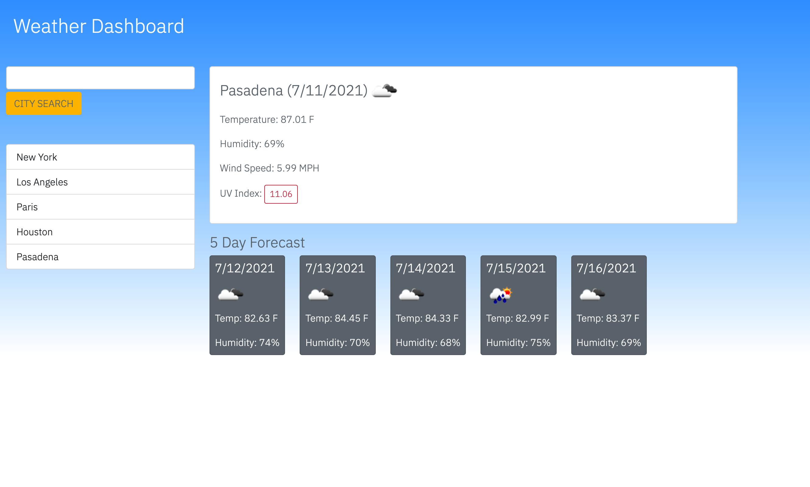

<h1 align="center">
    Weather Dashboard
</h1>

## Description

WEATHER DASHBOARD is a simple web-based app that allows users to enter a city name, then see current weather information including a 5-day forecast for that city. The app utilizes local storage to save searches in a clickable list in a column at the left side of the browser window.

## Contents 

* [Installation](#installation)

* [Usage](#usage)

* [License](#license)

* [Contributing](#contributing)

* [Tests](#tests)

* [Questions](#questions)

## Installation

The app can be cloned (https://github.com/JoeMerrell/weather-dashboard) and run locally or on a server. The app itself can be viewed/used at https://joemerrell.github.io/weather-dashboard/.

## Usage

The site itself is straightforward. Simply enter the name of a city in the search box and click the “CITY SEARCH” button. Current weather information as well as a 5-day forecast for that city will be displayed.

## License

This project's license is: MIT
  
## Contributing

At this point I have no specific plans for accepting contributions; though if you have suggestions or would like to start a new branch, please contact me at the email address in the Questions section.

## Tests

N/A

## Questions

If you have any questions about the repo, open an issue or contact Joe Merrell (me) directly at joe@uhhuhohyeah.com. You can find more of my work at my github account: https://github.com/JoeMerrell.github.

